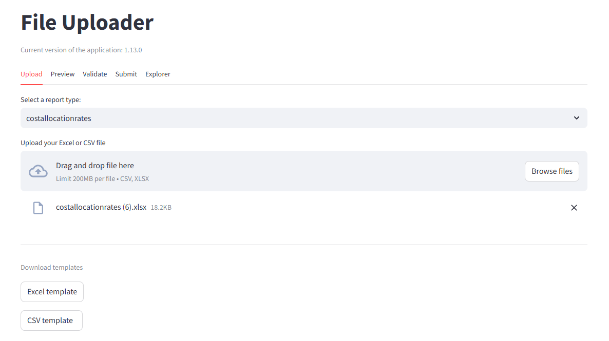

# FileUploader 📤

## Introduction

FileUploader is a web-based application designed for uploading, displaying, validating, sending, and reviewing user Excel and CSV files destined for the Data Platform.

## Key Features ✨

* **Upload:** Upload CSV or Excel files based on predefined report types.
* **Preview:** Display a preview of the uploaded data.
* **Validate:** Validate file structure and content against rules defined in YAML configuration.
* **Submit:** Submit validated files to Azure Data Lake Storage.
* **Explorer:** 5. Explorer: View, delete, and download files from Azure storage.

## Application Preview 🖼️



## Technology Stack 💻

* **Frontend:** Streamlit (for the user interface with tabs: Upload, Preview, Validate, Submit, Explorer)
* **Configuration:** YAML (for defining report structures, validation rules, and expected data types)
* **Data Processing/Validation:** dbt (Data Build Tool) with DuckDB as the backend engine.
* **Storage:** Microsoft Azure Data Lake Storage Gen2.
* **Environment Management:** Python-dotenv (for handling environment variables).

## Requirements 🛠️

* **Python:** Version 3.8 or higher.
* **dbt Core:** The command-line tool `dbt` needs to be runnable. It's typically installed as part of the Python packages (see Installation step 4).
* **Azure Credentials:** Valid Azure service principal credentials (Tenant ID, Client ID, Client Secret) or other supported authentication methods with permissions to access the target Azure Data Lake Storage container. These are needed for the `.env` file.
* **Azure Storage Account:** The **Soft delete for blobs** feature **must be disabled** on the storage account for the application's delete functionality to work as expected. 
* **Python Packages:** Listed in `requirements.txt`.

## Installation ⚙️

1. **Clone the Repository:**

    ```bash
    git clone https://github.com/marko2212/file-uploader.git
    cd file-uploader
    ```

    *(You are now in the project root directory)*

2. **Create a Virtual Environment:** (Choose **one** method)

    * **(A) Using `uv` (Recommended if installed):**
        *Requires `uv` to be installed (`pip install uv` or see [uv installation docs](https://github.com/astral-sh/uv#installation)).*

        ```bash
        # Creates a virtual environment named .venv by default
        uv venv
        ```

    * **(B) Using standard `venv`:**

        ```bash
        # Creates a virtual environment named .venv
        python -m venv .venv
        ```

3. **Activate the Virtual Environment:**

    ```bash
    # Activate the environment
    .venv\Scripts\Activate # Windows: 
    source .venv/bin/activate # macOS/Linux: 
    ```

4. **Install Python Dependencies:**
    *Make sure your virtual environment is active first!*
    * Using `uv` (recommended for speed):

        ```bash
        uv pip install -r requirements.txt
        ```

    * Or using standard `pip`:

        ```bash
        pip install -r requirements.txt
        ```

    *This step installs Streamlit, dbt-core, dbt-duckdb, Azure SDKs, pandas, etc.*

5. **Install dbt Project Dependencies:**
    *dbt projects can have their own package dependencies (e.g., utility macros) defined in `packages.yml`. This command installs them.*

    ```bash
    # Navigate to the dbt project directory
    cd FileUploaderDBT
    # Install dbt packages
    dbt deps
    # Return to the root project directory
    cd ..
    ```

6. **Set up Environment Variables:**
    * Copy the `.env.example` file to a new file named `.env` in the project root directory (`file-uploader` or your local folder name).
    * Open the `.env` file and fill in the necessary environment variables, especially your Azure credentials (e.g., `AZURE_TENANT_ID`, `AZURE_CLIENT_ID`, `AZURE_CLIENT_SECRET`, `AZURE_STORAGE_ACCOUNT_NAME`, `AZURE_CONTAINER_NAME`).

7. **Configure dbt `profiles.yml`:**
    *This file tells dbt how to connect to your data warehouse/database (in this case, a local DuckDB file).*
    * Locate or create the `profiles.yml` file in your dbt user directory:
        * **Windows:** `%USERPROFILE%\.dbt\` (e.g., `C:\Users\YourUsername\.dbt\profiles.yml`)
        * **Unix/Linux/MacOS:** `~/.dbt/` (e.g., `/home/yourusername/.dbt/profiles.yml`)
    * Add or ensure the following profile configuration exists within the `profiles.yml` file:

        ```yaml
        FileUploaderDBT: # This name should match the 'profile' setting in your dbt_project.yml
          outputs:
            dev: # The target environment name
              type: duckdb
              # Path relative to the dbt project root (FileUploaderDBT)
              path: ../db.duckdb
          target: dev # Specifies the default target to use
        ```

    * **Important:** Ensure the `path` correctly points to where the `db.duckdb` file should be created/read relative to the location of your `dbt_project.yml` file (inside `FileUploaderDBT`). The `../db.duckdb` path implies the database file lives one level *up* from the dbt project directory, i.e., in the main `file-uploader` directory.

## Configuration Summary 🔑

* **`.env` file:** Located in the project root directory. Contains sensitive credentials and environment-specific settings like Azure connection details. Must be created from `.env.example`.
* **`profiles.yml`:** Located in your user's `.dbt` directory. Configures how `dbt` connects to the data backend (DuckDB in this setup). See Installation Step 6.
* **Report YAML files:** (e.g., inside a `configs` or `definitions` directory - *mention where they are if applicable*) Define the structure, columns, and validation rules for each expected file type.

## Running the Application 🚀

1. Make sure your virtual environment (`.venv` or your chosen name) is **activated**.
2. Ensure the `.env` file is correctly configured in the project root (`file-uploader` or your local folder name).
3. Ensure your `profiles.yml` is set up correctly.
4. Navigate to the project's root directory in your terminal.
5. Launch the Streamlit application:

    ```bash
    streamlit run main_app.py
    ```

6. Streamlit will provide a local URL (usually `http://localhost:8501`). Open this URL in your web browser.

## Support 🤝

If you encounter any problems or have questions regarding the FileUploader application, please contact the development team or open an issue in the repository.

## Author 👨‍💻

* Marko A

---
